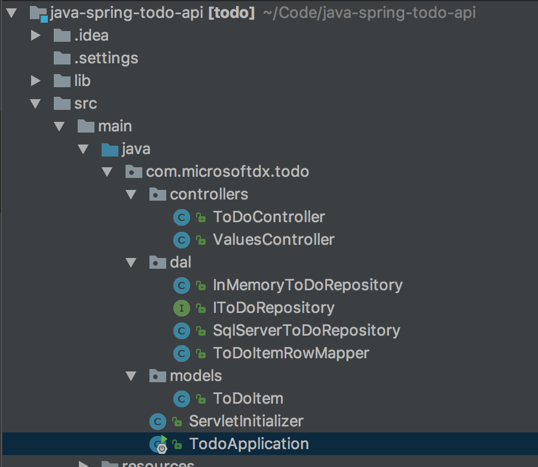
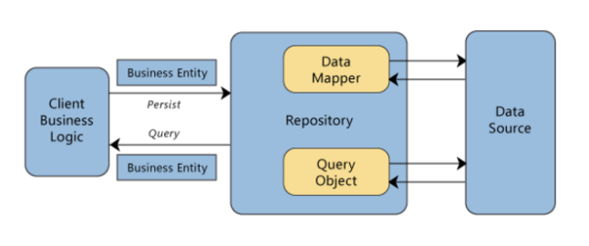

The Java Spring application
===========================

Introduction
-------------

> Spring is the most popular application development framework for enterprise Java. Millions of developers around the world use Spring Framework to create high performing, easily testable, reusable code.

> Spring framework is an open source Java platform and it was initially written by Rod Johnson and was first released under the Apache 2.0 license in June 2003.

> [For a complete list of Spring projects and examples, see this article.](https://spring.io/guides)

We will create the same backend for our application as we do in .NET, this time using Java and Spring. The concepts are very similar, and many steps involved in testing the application will be identical.

Importing the project in IntelliJ
----------------------------------

First of all, you need to get the `java-spring-todo-api` project on your machine. You can accomplish this through at least two steps:

- `git clone https://github.com/microsoft-dx/java-spring-todo-api`

or

- [download the project as ZIP](https://github.com/microsoft-dx/java-spring-todo-api/archive/master.zip) and unarchive

Next, you need to import it in your Java IDE (in our case IntelliJ): *File* --> *New* --> *Project from Existing Sources*, then select the location of the project you just downloaded from GitHub and **import from a Maven model**.

This is how it should look after importing:

Examining the Java backend
---------------------------

Looking at the project, we can see a few classes:

- `ToDoItem` - this class represents our to do object we will pass between the mobile application and the backend and has an id, some text, geographical coordinates of the place it was created from and a true/false value that marks if the item has been done. It also has two constructors (why?) and a method for updating the properties.

A model is an object that represents data in your application. It should contain all validation needed and all business logic.  Spring can automatically serialize the models to JSON or XML, all you have to do is make sure the client (mobile application in our case) knows how to interpret the data it receives.

 `ToDoRepository` – almost all non-trivial applications have to retrieve  data from a data store – SQL database, NoSQL database, a cache or any other data store. Directly accessing the data can result in duplicated code, higher potential for errors, the inability to centralize the database access and the possibility to interchange components. 

> [For more information on the repository pattern, see this article](https://msdn.microsoft.com/en-us/library/ff649690.aspx)

The best practice when working with a data store is to separate the logic of accessing and modifying the database as a separate component. This separate component, along with the model, should contain all business logic and validation.

> If you run the application right now, the repository used is [`InMemoryToDoRepository`](https://github.com/microsoft-dx/java-spring-todo-api/blob/master/src/main/java/com/microsoftdx/todo/dal/InMemoryToDoRepository.java) which holds the data in a `List<ToDoItem>`.

> In the next session we will create an Azure SQL database and also add another repository, which will use the Azure SQL database. [More details here](03-azure-sql.md).

A controller is an object that handles HTTP requests. Each request is mapped to a particular controller, and based on the parameters of the request, to a specific action (method) on that controller.

In Spring, in order to map a controller metod to a URL you simply specify the URL as an annotation to the method and the framework takes care of the mapping.

**Tasks**
---------

- implement the appropriate methods for `InMemoryToDoRepository` in order to Create, Read, Update and Delete ToDoItem objects
- implement the appropriate methods for `ToDoController`

