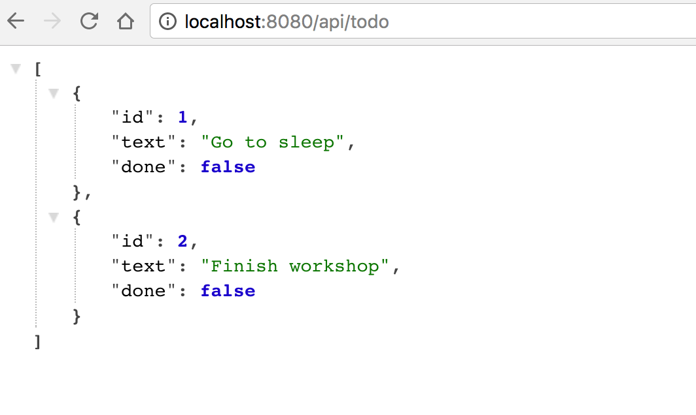
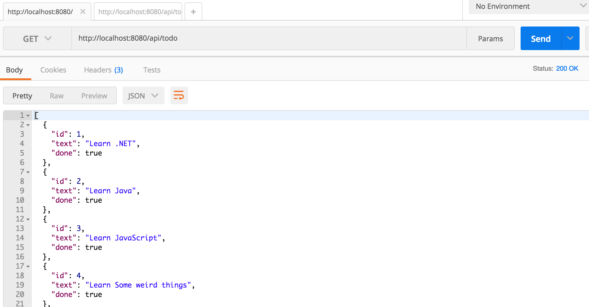

Consuming data from the APIs we created
========================================

Testing the application with PostMan
------------------------------------

Now that you created a first version of the application, it is time to test it, and we will do this in several ways:

- using the browser: start the application, open a new browser tab and navigate to `http://localhost:port-number/api/todo` - but because from accessing a URL from the browser you can only execute a GET request, in order to test the other controller methods we will need an additional tool.

- using [PostMan](https://chrome.google.com/webstore/detail/postman/fhbjgbiflinjbdggehcddcbncdddomop) - a Google Chrome extension that makes it easy to make HTTP requests.

Testing the application using a web front-end
---------------------------------------------

[In this repository](https://github.com/microsoft-dx/angular-todo) you can find an Angular application that can be used to test the API you created.

At this moment, it doesn't implement all features you developed for the backend. You task is to add:

- deleting a tdo
- updating a to do