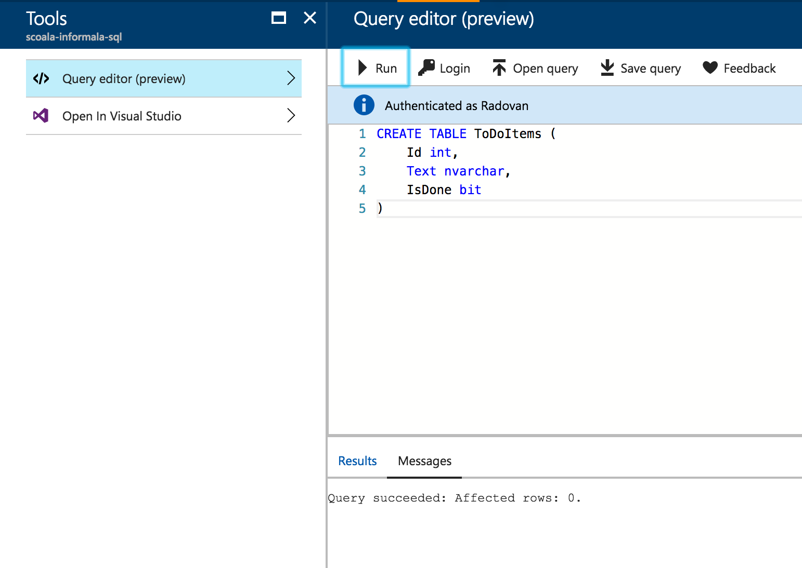
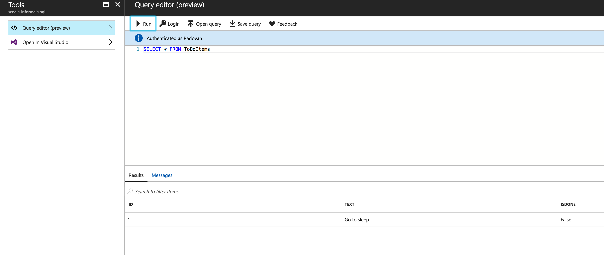
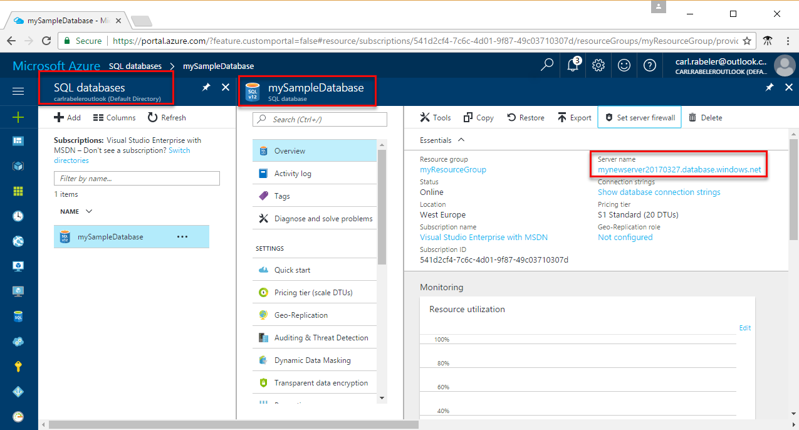
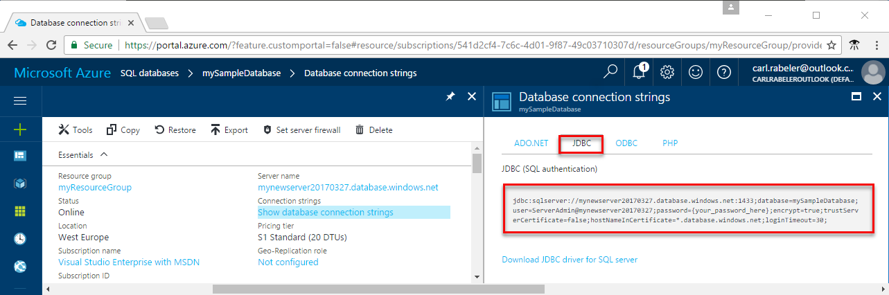

Azure SQL
=========

Deploying an Azure SQL database
--------------------------------

Assuming you configured the Azure subscription correctly, you should be able to create resources in the [Azure Portal](http://portal.azure.com).
Following the steps in this [tutorial from the official Microsoft documentation](https://docs.microsoft.com/en-us/azure/sql-database/sql-database-get-started-portal), go ahead and create an Azure SQL database.

> [Here you can find a technical overview of Azure SQL, how it works and the benefits from using it](https://docs.microsoft.com/en-us/azure/sql-database/sql-database-technical-overview).
> Make sure you remember the username and password you set up when creating the server, you will need them when accessing the database.

Creating a table to store `ToDoItem` objects
---------------------------------------------

We are going to use an online query editor inside the Azure Portal that will allow us to execute SQL statements against the database directly from the browser. First, we need to login using the credentials we used to create the database in the first place.



To create the table we will use a very simple SQL statement:

```
CREATE TABLE ToDoItems (
    Id int,
    Text nvarchar(255),
    IsDone bit
)
```

After creating the table, we are now ready to insert our first entry in the database:

```
INSERT INTO ToDoItems (Id, Text, IsDone)
VALUES (1, 'Go to sleep', 0)
```

Now we can query the database:

`SELECT * FROM ToDoItems`



Now we are ready to integrate the database into our applications.

Using the database in the Java Spring application
-------------------------------------------------

First of all we need to get the connection string that is specific to the [JDBC driver](https://docs.oracle.com/javase/tutorial/jdbc/basics/):




At this point we will create a new class that implements the `IToDoRepository` class, this time a [`SqlServerToDoRepository`](https://github.com/microsoft-dx/java-spring-todo-api/blob/master/src/main/java/com/microsoftdx/todo/dal/SqlServerToDoRepository.java).

> As a starting point for this we will use this [tutorial from the offiial Microsoft documentation](https://docs.microsoft.com/en-us/azure/sql-database/sql-database-connect-query-java#select-data)

> This [resource from the official Spring documentation details using Spring and JDBC](https://docs.spring.io/spring/docs/current/spring-framework-reference/html/jdbc.html)

Since this class also implements `IToDoRepository`, it will contain the same method signatures, but with specific implementation for connecting to SQL Server (compared to holding in-memory data).


